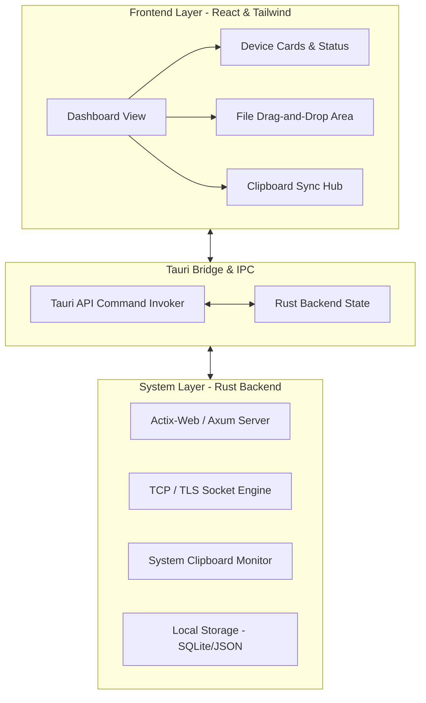
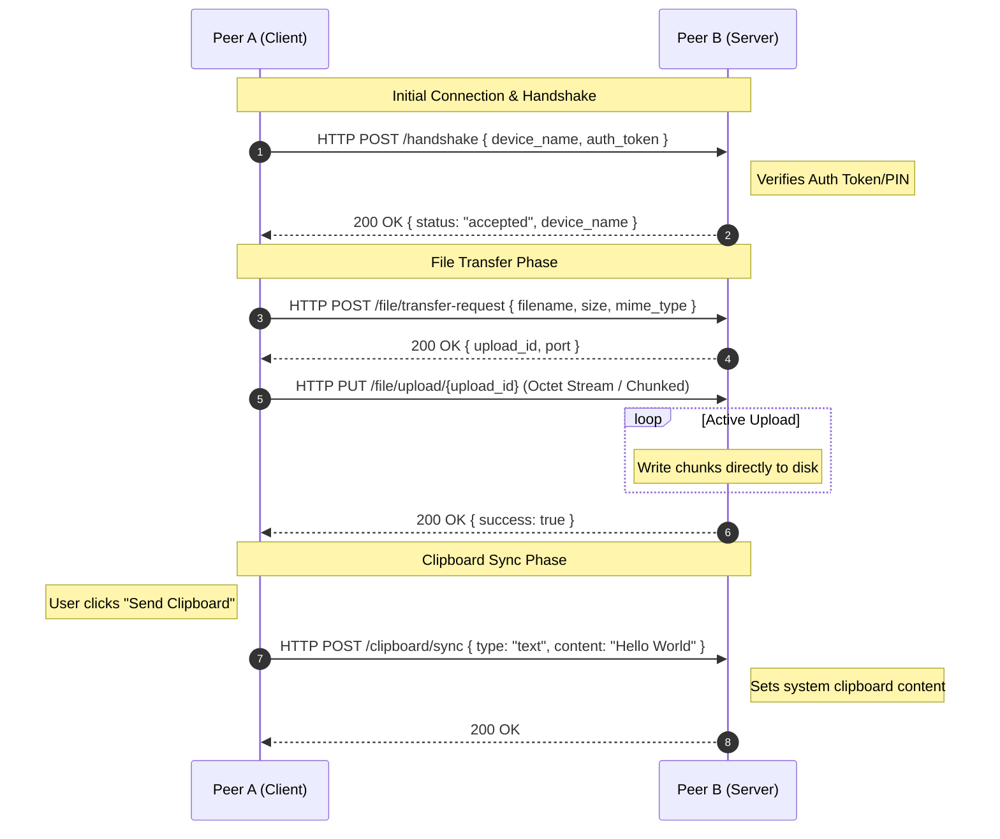

# ConnectShare: Technical Architecture & Design Document

ConnectShare is a lightweight, high-performance desktop utility designed to facilitate seamless file sharing and clipboard synchronization between computers on the same local area network (LAN) with known IP addresses. 

This document outlines the framework selection, networking protocols, security considerations, implementation details, and user interface design for the application.

---

## 1. Technology Stack & Framework Selection

To build a high-fidelity local sharing application that integrates deeply with the operating system (filesystem, clipboard, drag-and-drop) while maintaining a premium, fluid user experience, the following technology stack has been selected:

### Recommended Stack: **Tauri (Rust + React/TypeScript + TailwindCSS)**



### Stack Justification & Comparison

| Criteria | Tauri (Rust + Web) [Recommended] | Electron (Node + Web) | Flutter (Dart) | Python (PyQt / PySide) |
| :--- | :--- | :--- | :--- | :--- |
| **Executable Size** | **~10 - 15 MB** (Extremely lightweight) | ~150 - 200 MB (Includes Chromium) | ~30 - 50 MB | ~50 - 100 MB (with interpreter) |
| **RAM Usage** | **Low (~30 - 50 MB)** | High (~150 - 300 MB+) | Moderate (~80 - 120 MB) | Moderate (~80 - 100 MB) |
| **Performance** | **Native speed** (Rust compiled backend) | High CPU overhead | Good | Moderate |
| **Security** | **Strong** (Rust memory safety, sandboxed webview) | Complex (Node integration risks) | Moderate | Moderate |
| **UI Flexibility** | **Unlimited** (HTML5, CSS, React, Framer Motion) | Unlimited | Structured (Flutter widgets) | Limited (Qt styles are rigid) |
| **Networking** | **Exceptional** (Rust multi-threaded web servers) | Good (Node.js networking) | Good | Easy but single-threaded by default |

> [!TIP]
> **Why Tauri over Electron?**
> A local file-sharing utility runs constantly in the background. Electron's dependency on a full Chromium instance consumes hundreds of megabytes of RAM. Tauri uses the operating system's native Webview (Webkit on macOS, WebView2 on Windows), reducing memory consumption by over 80% and making it perfect for an unobtrusive background tool.

---

## 2. UI/UX Design Mockup

To achieve a modern and premium design, the interface utilizes a dark-mode theme, glassmorphic card layouts, curated vibrant gradients, and clear real-time status indicators. 

Below is the design mockup representing the visual interface of **ConnectShare**:


### Core UI Components:
1. **Network Devices Sidebar**: Lists registered devices, their local IP addresses, and their connection states (`Active`, `Connecting`, `Offline`).
2. **Share File Panel**: Interactive drag-and-drop zone that handles OS-level file drops, indicating active progress bars, speeds, and file sizes.
3. **Clipboard Sync Panel**: Displays a history of copied text and images, showing origin devices, timestamps, and a quick "Send Clipboard" action button.

---

## 3. System Architecture & Dual-Role Model

Since ConnectShare operates in a peer-to-peer (P2P) fashion on a local network, every instance of the application acts as both a **Server** (listening for incoming files and clipboard updates) and a **Client** (initiating outgoing connections, file uploads, and clipboard transfers).



---

## 4. Networking & Protocols

### A. HTTP/2 and raw TCP over TLS
To ensure that transfers are fast, secure, and handle large file streams efficiently, we use a hybrid networking model:
1. **Control Channel (HTTP/2 with TLS)**: Used for handshakes, pings, connection testing, metadata exchange, and small payloads like clipboard text.
2. **Data Channel (TCP Stream / HTTP Put)**: Used for streaming file contents directly from the filesystem to the network socket, avoiding buffering entire files in memory.

### B. REST API Specifications (Internal Server)

Each node spins up a background HTTP server (using `axum` in Rust) bound to a dedicated port, e.g., `50050`.

#### 1. Handshake & Ping
* **Endpoint**: `POST /api/v1/handshake`
* **Request Payload**:
  ```json
  {
    "device_name": "MacBook Pro",
    "ip_address": "192.168.1.100",
    "auth_token": "a8f3b2c9"
  }
  ```
* **Response (200 OK)**:
  ```json
  {
    "status": "connected",
    "device_name": "Windows Desktop",
    "protocol_version": "1.0.0"
  }
  ```

#### 2. File Transfer Request
* **Endpoint**: `POST /api/v1/files/request`
* **Request Payload**:
  ```json
  {
    "filename": "Project_Update.pdf",
    "size_bytes": 1887436,
    "mime_type": "application/pdf"
  }
  ```
* **Response (200 OK)**:
  ```json
  {
    "approved": true,
    "transfer_token": "tx_9f8d7e6c",
    "destination_path": "/Downloads/ConnectShare"
  }
  ```

#### 3. File Stream Upload
* **Endpoint**: `PUT /api/v1/files/upload/{transfer_token}`
* **Headers**: `Content-Type: application/octet-stream`
* **Payload**: Raw binary stream.
* **Mechanism**: Rust backend processes the stream chunk-by-chunk using tokio's async I/O.

#### 4. Clipboard Sync
* **Endpoint**: `POST /api/v1/clipboard/sync`
* **Request Payload**:
  ```json
  {
    "type": "text", 
    "content": "https://github.com/...",
    "timestamp": 1718290234
  }
  ```
* **Response (200 OK)**: `{"status": "applied"}`

---

## 5. OS Integration & Mechanics

### A. Drag-and-Drop Implementation
1. **Frontend Hook**: React utilizes the HTML5 Drag and Drop API or Tauri's native file drop event (`tauri::window::FileDropEvent`).
2. **Backend Processing**: When a file is dropped over a device card:
   - Tauri captures the absolute path of the files.
   - The React frontend displays the loading state.
   - The Rust backend reads files in a separate thread pool using `tokio::fs::File` and streams it to the destination IP over the HTTP client.

### B. Clipboard Synchronization
1. **Manual Send**: Clicking "Send Clipboard" calls a Tauri command `send_clipboard_to_peer(peer_ip)`. The Rust backend reads the system clipboard using the `arboard` crate, package it into a JSON payload, and POSTs it to the target peer.
2. **Auto-Sync (Optional)**: A background loop monitors clipboard changes (hashing clipboard content and comparing it every 500ms). If changes are detected, it updates the local state and sends updates to currently connected peer(s).

---

## 6. Security Model

Since the application operates on local networks (which could be public or untrusted like coffee shops), security is paramount:

> [!IMPORTANT]
> **Security Requirements**
> 1. **TLS Encryption**: All TCP/HTTP traffic is encrypted using TLS. Since local IPs change, self-signed certificates are generated on the first boot, and public keys are exchanged during a brief, secure physical handshake (PIN entry).
> 2. **Authentication Token (PIN)**: To link two devices, the user must input a 6-digit dynamic PIN generated by the target device. This PIN is used to verify the TLS certificate fingerprint and establish a pre-shared cryptographic key.
> 3. **Directory Lock**: The server module must only write incoming files to a designated "Safe Folder" (e.g., `~/Downloads/ConnectShare`) and sanitize filenames to prevent path traversal attacks (e.g. `../../etc/passwd`).

---

## 7. Recommended Project Structure (Tauri v2)

```text
connectshare-app/
├── src-tauri/                 # Rust Native Code
│   ├── Cargo.toml             # Rust package manifest
│   ├── src/
│   │   ├── main.rs            # Application entrypoint
│   │   ├── server.rs          # Axum HTTP/TCP server for incoming streams
│   │   ├── client.rs          # HTTP client for outgoing requests & streams
│   │   ├── clipboard.rs       # OS clipboard watcher & helper
│   │   └── commands.rs        # Tauri frontend-to-backend IPC endpoints
│   └── tauri.conf.json        # Tauri configuration file
├── src/                       # Frontend Web Application (React + TypeScript)
│   ├── main.tsx               # React application entrypoint
│   ├── index.css              # Custom TailwindCSS style definitions
│   ├── components/            # Reusable UI components
│   │   ├── DeviceCard.tsx     # Card representing a peer
│   │   ├── DragDropZone.tsx   # File drop target
│   │   └── ClipboardPanel.tsx # Clipboard list & sync control
│   └── hooks/
│       └── useTauriEvents.ts  # Handlers for system file drop & notifications
├── package.json               # NPM configuration
├── tailwind.config.js         # Tailwind styling configs
└── vite.config.ts             # Vite build pipeline configs
```

---

## 8. Development Roadmap & Next Steps

1. **Phase 1: Local Server Setup**: Spin up the background HTTP/TCP server in Rust and test raw byte streaming between two localhost terminals.
2. **Phase 2: Handshake & Discovery**: Implement the manual IP registration, state persistence, and dynamic PIN connection handshake.
3. **Phase 3: GUI Development**: Create the Glassmorphic interface in React/Tailwind, mapping file drop events to the backend Rust streams.
4. **Phase 4: OS Clipboard Hooks**: Integrate the clipboard reader/writer and hook it into the desktop UI.
